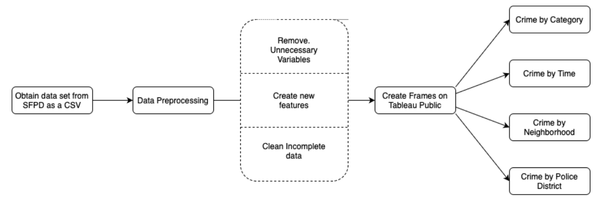

# San Francisco Crime 2018-2023 Data Visualization Using Tableau

## Objective
The objective of this project is to perform temporal and spatial data analysis and data visualization of San Francisco crimes in 2018 using Tableau.

## Technologies Used
* `Tableau`: The visualizations and dashboard were created using Tableau
* `Python`: We preprocessed the data on python
* `Jupyter`: Jupyter notebooks were created to facilitate the preprocessing
* `NumPy`: Numpy is a library in python that we used for numerical manipulations
* `Pandas`: Pandas library in python handles the management of datasets in form of data frame variables

## Description of Work
Our goal for the San Francisco temporal and spatial crime analysis is to create four dashboards that provide insights into our key questions from Phase 1. These include identifying the most common times and locations for crimes, patterns of crime occurrence on specific days, and changes in crime rates and types over time. By creating these dashboards, we aim to gain insights into the temporal and spatial crime analysis in the city. These are our key questions below:
1. Is there a specific time when crimes typically happen?
2. Which neighborhoods are crimes most concentrated?
3. What days do crimes happen frequently?
4. Are crimes increasing or decreasing yearly?
5. What kinds of crimes are increasing or decreasing?

###  Design

The diagram above showcases the design of our visualization system. We obtained “Police Department Incident Reports: 2018 to Present” data from DataSF as our dataset and saved it as a CSV file. Then we preprocessed the data for our key questions by removing unnecessary variables, creating new features and cleaning incomplete data. We utilized Tableau to develop four unique dashboards that address questions within their respective categories of crime by category, crime by time, crime by neighborhood and crime by police district.

## Link to Dashboard

<noscript></noscript><object class='tableauViz'  style='display:none;'><param name='host_url' value='https%3A%2F%2Fpublic.tableau.com%2F' /> <param name='embed_code_version' value='3' /> <param name='site_root' value='' /><param name='name' value='TemporalandSpatialAnalysisofCrimesinSanFrancisco2018-2023_16829232435660&#47;OverviewDashboard' /><param name='tabs' value='yes' /><param name='toolbar' value='yes' /><param name='static_image' value='https:&#47;&#47;public.tableau.com&#47;static&#47;images&#47;Te&#47;TemporalandSpatialAnalysisofCrimesinSanFrancisco2018-2023_16829232435660&#47;OverviewDashboard&#47;1.png' /> <param name='animate_transition' value='yes' /><param name='display_static_image' value='yes' /><param name='display_spinner' value='yes' /><param name='display_overlay' value='yes' /><param name='display_count' value='yes' /><param name='language' value='en-US' /></object>
                
The full public dashboard can be found at https://public.tableau.com/app/profile/gian.carlo.baldonado/viz/TemporalandSpatialAnalysisofCrimesinSanFrancisco2018-2023_16829232435660/OverviewDashboard.